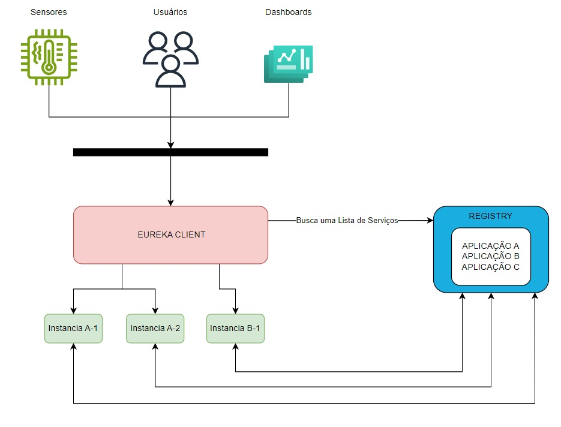

# Projeto de Análise Climática em São Luís

Este repositório contém a especificação do projeto de análise climática em São Luís, desenvolvido pelos alunos Clebson Mendonça Machado da Silva, Luiz Felipe Silva Santos e Miquéias Pereira Coelho, como parte do curso de Engenharia da Computação da Universidade Federal do Maranhão.

## Diagrama

Diagrama que representa sistema desenvolvido:

## Objetivos

O objetivo geral do projeto é desenvolver uma aplicação para análise climática utilizando dados temporais na cidade de São Luís junto a dados climaticos disponibilizados pelo INPE. Os objetivos específicos incluem:

- Utilizar múltiplos sensores para análise de dados climáticos em diferentes pontos da cidade de São Luís diariamente;
- Utilizar diferentes métricas estatísticas sobre as mudanças climáticas percebidas em um dado período;
- Desenvolver middleware de comunicação entre aplicações;
- Obtenção de dados do INPE para comparação e análise com dados obtidos localmente;
- Utilizar diferentes gráficos para visualização dos dados.

## Prazos

O prazo para a conclusão do projeto é até o dia 27 de novembro de 2023. Para atingir esse objetivo, foi criado um cronograma detalhado, que pode ser encontrado abaixo.

## Cronograma

| Data       | Atividade                                                                                                                                                                                                                                                  | Status |
| ---------- | ---------------------------------------------------------------------------------------------------------------------------------------------------------------------------------------------------------------------------------------------------------- | ------ |
| 31/08/2023 | Especificação do Projeto                                                                                                                                                                                                                                   | ✅     |
| 26/09/2023 | Atualização da Especificação - Adicionando detalhes sobre Middleware                                                                                                                                                                                       | ✅     |
| 03/10/2023 | Pesquisa e definição sobre aplicações que compõem o sistema                                                                                                                                                                                                | ✅     |
| 10/10/2023 | Instalação de sensores e aplicação de monitoramento e tratamento de dados                                                                                                                                                                                  | ✅     |
| 17/10/2023 | Desenvolvimento de Middleware de comunicação entre serviços                                                                                                                                                                                                | 🟡     |
|            | <ul><li>Implementação Spring Cloud ✅</li><li>Implementação microsserviços de leitura e escrita de dados dos sensores ✅</li><li>Implementação de mensageria ✅</li><li>Conexão com Mongo-db Cloud 🟡</li><li>Instalação de servidor em cloud 🟡</li></ul> |        |
| 24/10/2023 | Desenvolvimento de aplicação de obtenção de dados do INPE                                                                                                                                                                                                  | 🟡     |
| 07/11/2023 | Desenvolvimento de Front-end para visualização                                                                                                                                                                                                             | 🟡     |
|            | <ul><li>Pagina de detalhes sensor ✅</li><li>Pagina de cadastro de novos sensores ✅</li><li>Tornar responsivo 🟡</li><li>Conexão com API 🟡</li></ul> |        |
| 14/11/2023 | Integração de middleware com front-end e sensores                                                                                                                                                                                                             | 🔲     |
| 21/11/2023 | Testes e validação da aplicação                                                                                                                                                                                                                            | 🔲     |
| 28/11/2023 | Entrega final do projeto                                                                                                                                                                                                                                   | 🔲     |

### Progresso Geral

`▓▓▓▓▓▓▓▓▓▓▓▓▓▓▓▓▓▓▓▓▓▓▓▓▓▓▓▓▓▓▓░░░░░░░░░░░░░░░░`

## Recursos

Os recursos utilizados no projeto incluem:

- Dispositivos embarcados: três Esp-32;
- Sensor de temperatura DHT11 para aferição dos valores;
- Servidor em nuvem para armazenamento dos dados coletados;
- Banco de dados NoSQL para salvar os dados intermediários do INPE.

## Middleware

Para este projeto, será utilizado o Spring Cloud Netflix como um middleware responsável por fazer a comunicação entre as diferentes aplicações. O Spring Cloud Netflix torna a comunicação entre aplicações, controle de falhas, alocação e liberação de recursos todos transparentes. Dessa forma, ele atende às características necessárias para que tal conjunto seja considerado um middleware, tais características podem ser encontradas nas literaturas que norteiam a disciplina.

Por mais que todos os recursos sejam acessados por meio de uma única porta, o middleware faz com que aplicações distintas rodem pelo mesmo caminho geral, dessa forma ocultando a informação de serem várias aplicações, pois assim, o sistema parece ser único e com caráter centralizado fisicamente.
